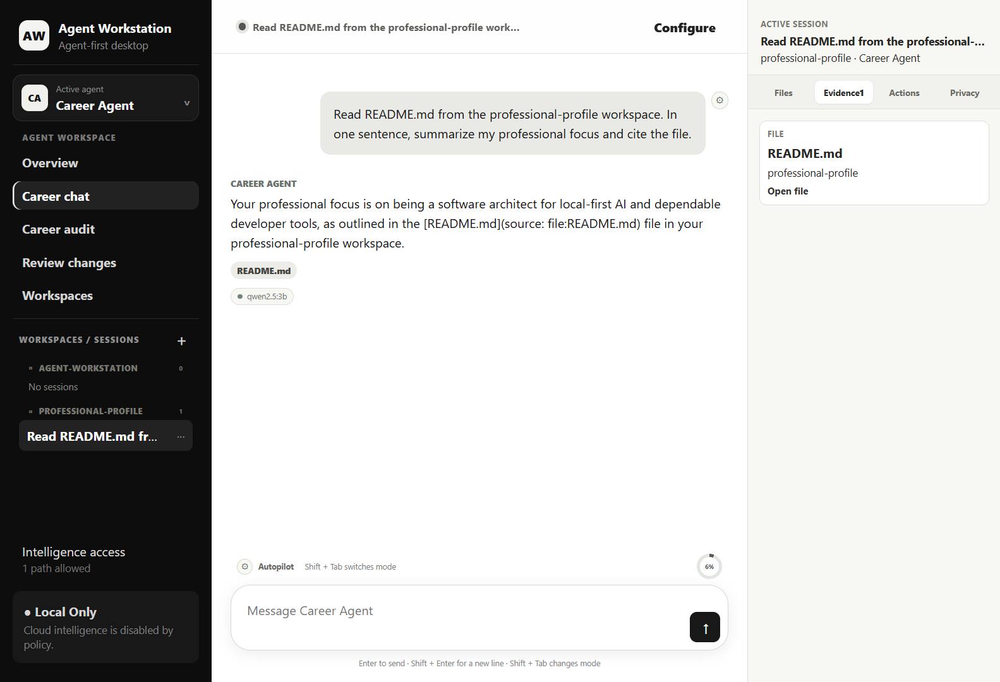
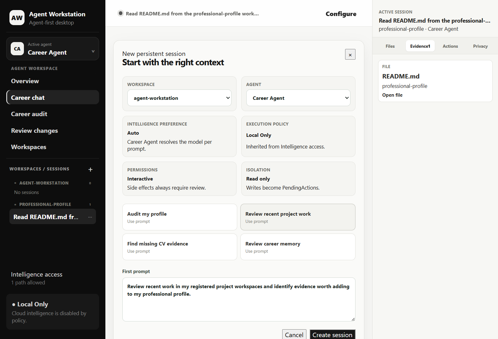
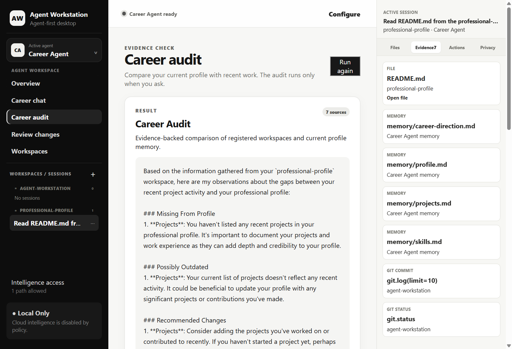
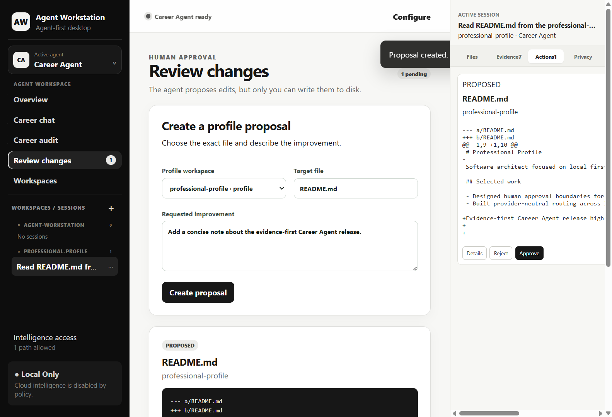

<div align="center">

# 🧭 Agent Workstation

### A local-first desktop workspace for evidence-backed AI agents — starting with Career Agent.

[](./package.json)
[](https://github.com/edgeetech/agentworkstation/actions/workflows/ci.yml)
[](#-install-and-run)
[](https://nodejs.org)
[](#-safety-and-privacy)

**Workspaces → Persistent sessions → Evidence-backed answers → Human-approved actions**

Agent Workstation connects specialist agents to real local work without turning
your repositories over to an opaque chat window. You decide which intelligence
paths are allowed; the app selects an available model per prompt, shows what it
used, cites workspace evidence, and requires approval before any file is changed.

</div>

---

## ⚡ Why Agent Workstation?

AI can write a convincing answer without understanding your actual work. Career
history is especially vulnerable: project evidence is spread across repositories,
profiles go stale, and a generic assistant cannot safely inspect or update either.

Agent Workstation makes that workflow concrete:

- register the profile, CV, and project repositories you want the agent to use;
- keep separate, persistent sessions tied to the right workspace;
- let the application choose between allowed local and connected intelligence;
- inspect the files, Git history, and memory behind an answer;
- review an exact diff before approving or rejecting a proposed change.

Release 0.1 delivers this as a Windows-first Electron application with **Career
Agent** as the complete specialist-agent vertical slice.

---

## 🖼️ Product tour

### Ask about real work, not an isolated prompt

Career Agent can read registered workspace files and Git evidence through bounded
tools. Every response keeps the resolved model and source references visible.

<div align="center">

[](./docs/images/career-agent-chat.png)

<sub>Real local Ollama response using <code>qwen2.5:3b</code>, with the source file shown in the Evidence inspector. <a href="./docs/images/career-agent-chat.png">Click to enlarge</a>.</sub>

</div>

### One focused window: context, evidence, and action

<table>
  <tr>
    <td width="50%" valign="top">
      <a href="./docs/images/new-session-composer.png"></a>
      <br><strong>Start with explicit context</strong><br>
      Bind a persistent session to a workspace and agent. Auto intelligence,
      execution policy, permissions, isolation, and declarative quick actions
      are visible before the first prompt.
    </td>
    <td width="50%" valign="top">
      <a href="./docs/images/evidence-first-audit.png"></a>
      <br><strong>Audit against structured evidence</strong><br>
      Compare profile material with registered project activity and inspect the
      exact files, memory entries, commits, diffs, and status records used.
    </td>
  </tr>
  <tr>
    <td colspan="2" valign="top">
      <a href="./docs/images/human-approval.png"></a>
      <br><strong>Review the diff; keep control of the write</strong><br>
      The model proposes. Agent Workstation creates a PendingAction. Only the
      application can write after explicit human approval.
    </td>
  </tr>
</table>

All screenshots were captured from the Release 0.1 desktop application against
synthetic repositories. No private workspace content is included.

---

## ✨ What works today

| | |
|---|---|
| 🧭 **Agent-first desktop shell** | Workspace and session navigation on the left, the focused Career Agent workflow in the center, and Files / Evidence / Actions / Privacy on the right. |
| 💬 **Persistent Career Agent chat** | Create, switch, rename, and delete workspace-bound conversations. History, mode, model route, and context usage survive restarts. |
| 🗂️ **Many registered workspaces** | Register profile, CV, and project repositories. Career Agent can reason across them while each active session keeps one authoritative workspace context. |
| 🔎 **Evidence-first inspection** | Browse safe workspace files and inspect structured provenance from files, Git status, Git log, Git diff, and Career Agent memory. |
| 🧠 **Automatic intelligence routing** | Allow on-device Ollama, Ollama Cloud, detected provider CLIs, or a combination. The router evaluates the prompt and availability instead of asking the user to pick a model for every message. |
| 🟢 **Visible model availability** | See which local models and provider connections are available, limited, incompatible, or unavailable. The resolved model remains visible on each answer. |
| 🔁 **Usage-limit fallback** | HTTP 429 responses mark an intelligence candidate as limited, apply a cooldown, and allow routing to fall back to another permitted candidate. |
| 🚦 **Standard and Autopilot** | Standard keeps the agent more confirmatory. Autopilot — the default — proceeds through routine, reversible reasoning and asks only when an important decision or approval is required. |
| 📊 **Context awareness** | A continuously visible context indicator uses the application's authoritative prompt-budget calculation; it is not estimated separately in React. |
| ✅ **Human-approved editing** | File changes become PendingActions with an exact diff. Approval checks for stale source content before an atomic application-owned write. |
| 💾 **Restart recovery** | SQLite persists workspaces, sessions, messages, routing metadata, context-relevant state, and pending actions in Electron's user-data directory. |

---

## 🧠 Intelligence without model micromanagement

Users grant access to **paths**, not individual decisions:

```text
On-device Ollama models
        or
Ollama Cloud models
        or
Connected provider CLIs
        ↓
Prompt + policy + live availability
        ↓
Resolved model shown on the answer
```

The Release 0.1 provider paths are:

- **On-device Ollama** — tool-capable models discovered from the local Ollama
  runtime. Workspace context stays on the device.
- **Ollama Cloud** — discoverable Ollama cloud-tagged models. This path is
  separately permissioned because prompt context may leave the computer.
- **Connected provider CLIs** — detected Codex, GitHub Copilot, and Claude CLI
  installations that are already authenticated by their own provider tooling.
  Agent Workstation does not ask you to paste those provider credentials into
  the application.

The Intelligence Access screen shows what is installed and reachable before you
allow a path. Routing remains bounded by that permission: **Local Only** never
silently becomes cloud-enabled.

> The deterministic simulated provider is included for tests and offline demos.
> It is clearly labelled and is never presented as a real AI response.

---

## 🧑‍💼 Career Agent workflows

Career Agent is declarative: its instructions, memory, workflows, quick actions,
and tool policy live under [`src/agents/career/`](./src/agents/career/).

### Ask

Chat about a registered profile, CV, project, commit, working tree, or proposed
change. The agent can use `filesystem.read`, `git.status`, `git.log`, and
`git.diff` when the prompt requires evidence.

### Audit

Run an on-demand comparison of current profile material, Career Agent memory,
and recent project evidence. The result includes structured source references
that remain navigable in the inspector.

### Improve

Describe the change you want. Career Agent may call
`filesystem.proposeWrite`, but it cannot apply the write. The proposed content,
diff, workspace, target path, and routing metadata are stored as a PendingAction
until you approve or reject it.

Built-in quick actions cover:

- Audit my profile
- Review recent project work
- Find missing CV evidence
- Review career memory

---

## 🔒 Safety and privacy

- **Workspace-bounded file access.** `WorkspaceGateway` canonicalizes paths,
  rejects traversal and symlink escapes, denies sensitive filenames, and limits
  file size before content reaches an agent.
- **No renderer filesystem shortcut.** The Electron renderer uses narrow IPC
  contracts; it never receives arbitrary filesystem or Infrastructure access.
- **Policy-gated tools.** Read-only and side-effecting tools carry metadata and
  pass through `PolicyGate` and the application runtime.
- **Human approval before writes.** The model can only propose. Approval verifies
  that the target has not changed, then performs an atomic application-owned
  write.
- **Cloud is explicit.** External intelligence is considered only when the user
  permits the corresponding path. The UI distinguishes Auto preference,
  resolved intelligence, execution mode, and Cloud permitted / Local Only.
- **Provider credentials stay with providers.** Delegated CLI authentication is
  owned by Codex, Copilot, or Claude rather than copied into Agent Workstation.
- **No telemetry subsystem in the MVP.** The Privacy inspector reports this
  plainly and does not invent a network ledger that the runtime does not have.

Registered repositories are never moved into the application. Operational state
is stored in `agentworkstation.db` under Electron's per-user application-data
directory.

---

## 🚀 Install and run

### Requirements

- Windows 11 for the supported Release 0.1 desktop target
- Node.js 20+ — Node.js 22 recommended and used by CI
- npm 10+
- Git
- Optional: [Ollama](https://ollama.com/) running locally with at least one
  tool-capable model
- Optional: an installed and authenticated Codex, GitHub Copilot, or Claude CLI

### Development quick start

```powershell
git clone https://github.com/edgeetech/agentworkstation.git
cd agentworkstation
npm install
npm run electron:dev
```

`electron:dev` starts the Vite renderer and Electron host together.

Inside the app:

1. Open **Career Agent**.
2. Register at least one profile, CV, or project workspace.
3. Open **Intelligence access** and allow the paths Career Agent may use.
4. Refresh availability and save the policy.
5. Start a workspace-bound session or run a Career Audit.

### Browser-only renderer development

```powershell
npm run dev
```

Open `http://localhost:5173`. Desktop IPC-backed workflows require Electron.

### Build a Windows installer

```powershell
npm run electron:pack
```

The NSIS installer is written to `release/` and publishing is intentionally
disabled by the package command.

---

## 🧪 Quality gates

```powershell
npm run lint
npm test
npm run check:architecture
npm run electron:prepare
npm run test:e2e
```

The main CI workflow validates lint, architecture boundaries, unit, integration,
security, evaluation, Electron build, Windows desktop E2E, Windows packaging,
production dependency audit, and a macOS compatibility build gate.

The real-Ollama Playwright acceptance test is opt-in because it requires a local
model runtime:

```powershell
$env:AW_RUN_OLLAMA_ACCEPTANCE = "1"
npm run test:e2e
```

---

## 🏛️ Architecture

Agent Workstation is a Clean Architecture modular monolith:

```text
apps/desktop/
  main/                       Electron composition root and IPC handlers
  preload/                    Narrow renderer bridge
  renderer/                   React agent-first desktop experience
  shared/                     Cross-process DTO contracts

src/
  domain/                     Provider-neutral domain models
  application/                Runtime, policies, approvals, workflows, ports
  infrastructure/             Filesystem, Git, persistence, network, intelligence
  agents/career/              Declarative Career Agent definition and memory

tests/
  architecture/               Dependency-boundary enforcement
  unit/                       Domain, application, adapter, persistence coverage
  integration/                Real component collaboration
  security/                   Workspace and Electron security boundaries
  evaluation/                 Evidence quality and safe-editing acceptance
  e2e/                        Packaged desktop user journeys
```

The important dependency rule is simple:

```text
Domain ← Application ← Infrastructure / Electron
```

Domain does not know Electron, Ollama, Codex, Copilot, Claude, SQLite, React, or
the filesystem. Renderer code does not import Infrastructure.

For the full product and security specification, see
[`PROJECT_PLAN.md`](./PROJECT_PLAN.md). For the verified completion boundary and
deferred items, see [`UX_IMPLEMENTATION_STATUS.md`](./UX_IMPLEMENTATION_STATUS.md)
and [`WHATS_LEFT.md`](./WHATS_LEFT.md).

---

## 🎯 Release 0.1 scope

This repository currently delivers one complete specialist agent: **Career
Agent**. The shell and declarative agent contract can represent additional
agents, but no additional specialist experience is claimed in the MVP.

Release 0.1 does not include a terminal, browser, MCP management UI, plugin
marketplace, worktree engine, billing system, or SaaS routing service. Those are
not hidden features and are not presented here as commitments.

---

## 🤝 Contributing

Issues, feedback, and pull requests are welcome at
[github.com/edgeetech/agentworkstation](https://github.com/edgeetech/agentworkstation).

Please preserve the architecture and safety invariants documented in
[`PROJECT_PLAN.md`](./PROJECT_PLAN.md), especially workspace-bounded access,
policy-gated tools, provider-neutral application code, and human approval before
writes.
