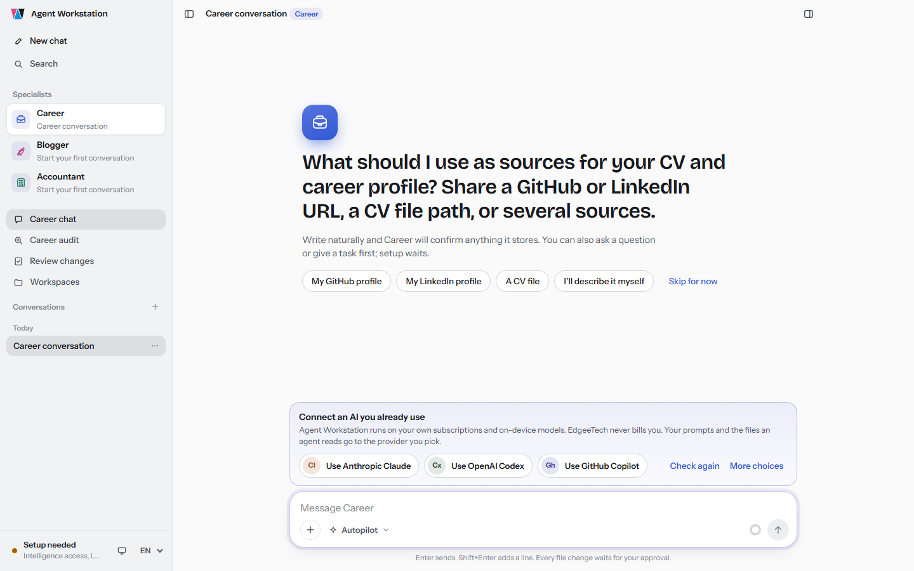
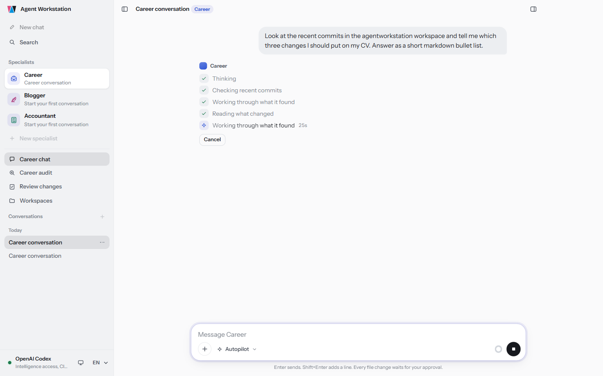
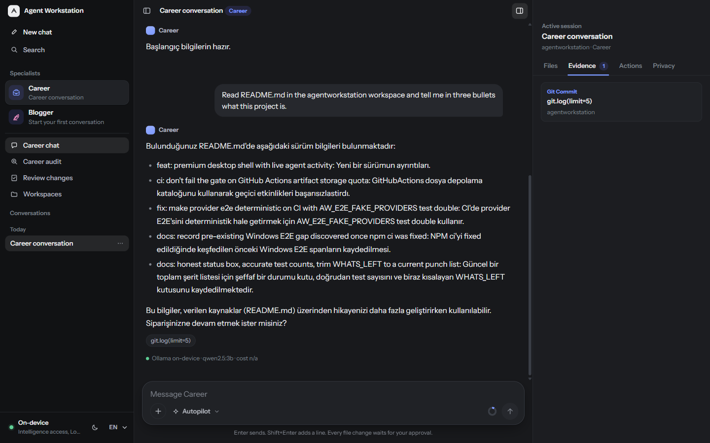
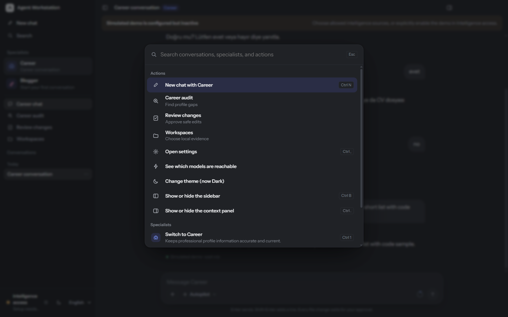

<div align="center">


# Agent Workstation

### A local-first hub where specialized AI agents work with real repositories, evidence, and human oversight.

[](./package.json)
[](https://github.com/edgeetech/agentworkstation/actions/workflows/ci.yml)
[](#-install-and-run)
[](https://nodejs.org)
[](#-safety-and-privacy)

**Many workspaces → Specialized agents → Persistent sessions → Evidence-backed actions**

Agent Workstation is the shared desktop home for specialized agents. Each agent
can bring its own purpose, instructions, memory, workflows, quick actions, and
tool policy while reusing one secure hub for workspaces, sessions, intelligence
routing, evidence, privacy, and human-approved actions.

You decide which repositories and intelligence paths are allowed. The hub selects
an available model per prompt, shows what it used, cites workspace evidence, and
requires approval before any file is changed.

> ## 📋 Status: personal-first, maintenance mode
>
> Agent Workstation is built primarily for the author's own use and is
> open-sourced as-is, installable by others; it is not offered as a commercial
> product or under any support commitment.
>
> **Works today** — Career Agent's chat, on-demand audit, and
> propose → review-diff → approve/reject flow over registered workspaces;
> routing to on-device Ollama or connected Claude (via the real
> `@anthropic-ai/claude-agent-sdk`); the Files/Evidence/Actions/Privacy
> inspector.
>
> **Experimental / incomplete** — the Blogger Agent's bilingual
> draft → visual → publication-bundle → Git delivery path is implemented and
> tested in isolation but has never been exercised end to end against a real
> site; LinkedIn posting requires each user to register and configure their
> own LinkedIn Developer OAuth client ID; a GitHub Copilot Agent SDK adapter
> is implemented but disabled (the installed `copilot` CLI reports an older
> JSON-RPC protocol than the SDK expects, so Copilot still runs through the
> plain CLI adapter — see [`WHATS_LEFT.md`](./WHATS_LEFT.md)); the packaged
> Windows installer is ~118 MB and unsigned (expect an unsigned-publisher
> warning); installed copies update themselves afterwards from GitHub Releases.
>
> **Privacy** — prompts, model replies, and proposed diffs are stored in
> plaintext in the local SQLite database under Electron's per-user
> `userData` directory. There is no telemetry and no analytics of any kind.
>
> **Lint strictness** — `no-console` and `@typescript-eslint/no-explicit-any`
> are enforced as errors (there were zero pre-existing violations to migrate).
>
> The codebase is roughly 19.9k lines of TypeScript/TSX, about 5.7k of which
> are tests (`npm test` runs 294 unit/integration/security tests; a separate
> Playwright suite covers 7 desktop end-to-end scenarios across 2 spec files).

---

## ⚡ Why Agent Workstation?

General-purpose chat is useful, but real work benefits from agents that understand
a domain, follow a defined workflow, use only appropriate tools, and retain the
right context. Building every specialist as a separate application would duplicate
workspace access, model connections, session history, evidence handling, and
safety controls.

Agent Workstation provides that common foundation:

- register the repositories you want specialized agents to use;
- select an agent for the job and keep its domain behavior declarative;
- keep separate, persistent agent sessions tied to the right workspace;
- let the hub choose between allowed local and connected intelligence;
- inspect the files, Git history, and memory behind an answer;
- review an exact diff before approving or rejecting a proposed change.

Release 0.1 proves this hub model as a Windows-first Electron application.
**Career Agent** is the first complete specialist: it connects profile and project
repositories, audits career evidence, and proposes human-reviewed improvements.
**Blogger Agent** is the second specialist and validates the multi-agent experience:
it learns from explicitly selected published writing, prepares natural Turkish and
English drafts, proposes original copyright-safe SVG visuals, and assembles exact
reviewable publication bundles. Site delivery is owned by Agent Workstation behind
target configuration, immutable content hashes, a production-branch check, separate
human approval, and live URL verification. LinkedIn posting remains unavailable until
a real OAuth connection is configured and the exact social copy receives its own approval.
**Accountant Agent** is the third specialist. It helps a small UK limited company director
stay on top of statutory deadlines and bookkeeping from their own CSV exports. Dates come
from a deterministic UK deadline calculator and totals from a deterministic ledger
summarizer, so the model explains the numbers but never invents them. It never files,
pays, or submits anything. Once the company's details are confirmed, Agent Workstation
also checks upcoming and overdue deadlines in the background and raises a native
notification, at zero model cost, so nothing has to be asked for proactively.

```text
Agent Workstation hub
├── Workspaces and persistent sessions
├── Intelligence routing and availability
├── Files, evidence, actions, and privacy
├── Policy gates and human approval
└── Specialized agent definitions
    ├── Career Agent
    ├── Blogger Agent (bilingual draft, visual, publication, and social workflows)
    └── Accountant Agent (UK company deadlines and bookkeeping checks from your exports)
```

---

## 🖼️ Product tour

### Feels like the desktop AI apps you already use

A frameless window, a quiet sidebar, one identity colour per specialist, light
and dark themes that follow the OS, and a command palette (`Ctrl+K`) for every
conversation, specialist, and action. On first run the app offers the AI you
already have (Claude Code, Codex, GitHub Copilot, or on-device Ollama) as
one-click choices; EdgeeTech never bills you.

<table>
  <tr>
    <td width="50%" valign="top">
      <a href="./docs/images/shell-first-run.png"></a>
      <br><strong>Connect what you already pay for</strong>
    </td>
    <td width="50%" valign="top">
      <a href="./docs/images/shell-live-activity.png"></a>
      <br><strong>See what the agent is doing, live</strong>
    </td>
  </tr>
  <tr>
    <td width="50%" valign="top">
      <a href="./docs/images/shell-dark-evidence.png"></a>
      <br><strong>Every answer keeps its evidence</strong>
    </td>
    <td width="50%" valign="top">
      <a href="./docs/images/shell-command-palette.png"></a>
      <br><strong>Keyboard first</strong>
    </td>
  </tr>
</table>

<sub>Captured from the desktop app against a local <code>qwen2.5:3b</code> Ollama model reading this repository.</sub>

### Ask about real work, not an isolated prompt

Career Agent can read registered workspace files and Git evidence through bounded
tools. Every response keeps the resolved model and source references visible.

<div align="center">

[](./docs/images/career-agent-chat.png)

<sub>Real local Ollama response using <code>qwen2.5:3b</code>, with the source file shown in the Evidence inspector. <a href="./docs/images/career-agent-chat.png">Click to enlarge</a>.</sub>

</div>

### One focused window: context, evidence, and action

<table>
  <tr>
    <td width="50%" valign="top">
      <a href="./docs/images/new-session-composer.png"></a>
      <br><strong>Start with explicit context</strong><br>
      Bind a persistent session to a workspace and agent. Auto intelligence,
      execution policy, permissions, isolation, and declarative quick actions
      are visible before the first prompt.
    </td>
    <td width="50%" valign="top">
      <a href="./docs/images/evidence-first-audit.png"></a>
      <br><strong>Audit against structured evidence</strong><br>
      Compare profile material with registered project activity and inspect the
      exact files, memory entries, commits, diffs, and status records used.
    </td>
  </tr>
  <tr>
    <td colspan="2" valign="top">
      <a href="./docs/images/human-approval.png"></a>
      <br><strong>Review the diff; keep control of the write</strong><br>
      The model proposes. Agent Workstation creates a PendingAction. Only the
      application can write after explicit human approval.
    </td>
  </tr>
</table>

All screenshots were captured from the Release 0.1 desktop application against
synthetic repositories. No private workspace content is included.

---

## ✨ What works today

| | |
|---|---|
| 🧭 **Specialized-agent hub** | Choose an agent, workspace, and persistent session on the left; work in the focused conversation at the center; inspect Files / Evidence / Actions / Privacy on the right. |
| 💬 **Persistent agent sessions** | Create, switch, rename, and delete workspace-bound conversations. Agent identity, history, mode, model route, and context usage survive restarts. |
| 🗂️ **Files when needed** | Paste a public URL or an exact absolute text-file path into chat for read-only inspection. Connect a folder only when the agent needs to explore further files or Git history. |
| 🔎 **Evidence-first inspection** | Browse safe workspace files and inspect structured provenance from files, Git status, Git log, Git diff, and agent memory. |
| 🧠 **Automatic intelligence routing** | Allow on-device Ollama, Ollama Cloud, detected provider CLIs, or a combination. The router evaluates the prompt and availability instead of asking the user to pick a model for every message. |
| 🟢 **Visible model availability** | See which local models and provider connections are available, limited, incompatible, or unavailable. The resolved model remains visible on each answer. |
| 🔁 **Usage-limit fallback** | HTTP 429 responses mark an intelligence candidate as limited, apply a cooldown, and allow routing to fall back to another permitted candidate. |
| 🚦 **Standard and Autopilot** | Standard keeps the agent more confirmatory. Autopilot — the default — proceeds through routine, reversible reasoning and asks only when an important decision or approval is required. |
| 📊 **Context awareness** | A continuously visible context indicator uses the application's authoritative prompt-budget calculation; it is not estimated separately in React. |
| ✅ **Human-approved editing** | File changes become PendingActions with an exact diff. Approval checks for stale source content before an atomic application-owned write. |
| 💾 **Restart recovery** | SQLite persists workspaces, sessions, messages, routing metadata, context-relevant state, and pending actions in Electron's user-data directory. |
| 📝 **Editable agent memory** | Confirmed setup facts live in `agents/<agent-id>/memory.json` under the same user-data directory. Use the chat `+` menu to open the file; valid edits are read on the next interaction. Existing SQLite memory is migrated on first access. |

---

## 🧠 Intelligence without model micromanagement

Users grant access to **paths**, not individual decisions:

```text
On-device Ollama models
        or
Ollama Cloud models
        or
Connected provider CLIs
        ↓
Prompt + policy + live availability
        ↓
Resolved model shown on the answer
```

The Release 0.1 provider paths are:

- **On-device Ollama** — tool-capable models discovered from the local Ollama
  runtime. Workspace context stays on the device.
- **Ollama Cloud** — discoverable Ollama cloud-tagged models. This path is
  separately permissioned because prompt context may leave the computer.
- **Connected provider CLIs** — detected Codex, GitHub Copilot, and Claude CLI
  installations that are already authenticated by their own provider tooling.
  Agent Workstation does not ask you to paste those provider credentials into
  the application.

> **Claude provider auth.** The Claude route runs through
> `@anthropic-ai/claude-agent-sdk` driving your local `claude` CLI. If the
> `ANTHROPIC_API_KEY` environment variable is set before launching Agent
> Workstation, the SDK uses it and bills through the standard metered API.
> Otherwise it falls back to your existing Claude Code subscription login —
> the model badge tooltip and Privacy panel disclose this so you can check
> Anthropic's terms on third-party/programmatic use of subscription
> credentials. Setting `ANTHROPIC_API_KEY` is the recommended path for
> connected Claude.

The Intelligence Access screen shows what is installed and reachable before you
allow a path. Routing remains bounded by that permission: **Local Only** never
silently becomes cloud-enabled.

> The deterministic simulated provider is included for tests and offline demos.
> It is clearly labelled and is never presented as a real AI response.

---

## 🧑‍💼 Career Agent workflows

Career Agent is the first specialist delivered through the hub. Its instructions,
memory, workflows, quick actions, and tool policy are declarative and live under
[`src/agents/career/`](./src/agents/career/); shared workspace, session,
intelligence, evidence, approval, and privacy capabilities remain hub concerns.

### Ask

Chat about a registered profile, CV, project, commit, working tree, or proposed
change. The agent can use `filesystem.read`, `git.status`, `git.log`, and
`git.diff` when the prompt requires evidence.

### Audit

Run an on-demand comparison of current profile material, Career Agent memory,
and recent project evidence. The result includes structured source references
that remain navigable in the inspector.

### Improve

Describe the change you want. Career Agent may call
`filesystem.proposeWrite`, but it cannot apply the write. The proposed content,
diff, workspace, target path, and routing metadata are stored as a PendingAction
until you approve or reject it.

Built-in quick actions cover:

- Audit my profile
- Review recent project work
- Find missing CV evidence
- Review career memory

---

## 🔒 Safety and privacy

- **Workspace-bounded exploration.** `WorkspaceGateway` canonicalizes paths,
  rejects traversal and symlink escapes, denies sensitive filenames, and limits
  file size before content reaches an agent. An exact absolute text-file path
  explicitly written by the user may also be read without connecting its folder;
  this grant does not extend to neighboring files.
- **No renderer filesystem shortcut.** The Electron renderer uses narrow IPC
  contracts; it never receives arbitrary filesystem or Infrastructure access.
- **Policy-gated tools.** Read-only and side-effecting tools carry metadata and
  pass through `PolicyGate` and the application runtime.
- **Human approval before writes.** The model can only propose. Approval verifies
  that the target has not changed, then performs an atomic application-owned
  write.
- **Cloud is explicit.** External intelligence is considered only when the user
  permits the corresponding path. The UI distinguishes Auto preference,
  resolved intelligence, execution mode, and Cloud permitted / Local Only.
- **Provider credentials stay with providers.** Delegated CLI authentication is
  owned by Codex, Copilot, or Claude rather than copied into Agent Workstation.
- **No telemetry subsystem in the MVP.** The Privacy inspector reports this
  plainly and does not invent a network ledger that the runtime does not have.

Registered repositories are never moved into the application. Operational state
is stored in `agentworkstation.db` under Electron's per-user application-data
directory; editable, non-secret setup memory is stored separately as per-agent JSON.

---

## 🚀 Install and run

Once installed, Agent Workstation keeps itself up to date automatically: a
packaged build checks GitHub Releases for this repository in the background
and installs a downloaded update the next time you restart the app (or
immediately, from the "Restart now" prompt it shows when one is ready). The
installer itself stays unsigned — there is no code-signing certificate — so
you still click through Windows' unsigned-publisher warning on first install.

### Requirements

- Windows 11 for the supported Release 0.1 desktop target
- Node.js 20+ — Node.js 22 recommended and used by CI
- npm 10+
- Git
- Optional: [Ollama](https://ollama.com/) running locally with at least one
  tool-capable model
- Optional: an installed and authenticated Codex, GitHub Copilot, or Claude CLI

### Development quick start

```powershell
git clone https://github.com/edgeetech/agentworkstation.git
cd agentworkstation
npm install
npm run electron:dev
```

`electron:dev` starts the Vite renderer and Electron host together.

Inside the app:

1. Select **Career Agent**, the specialist included in Release 0.1.
2. Register at least one profile, CV, or project workspace.
3. Open **Intelligence access** and allow the paths agents may use.
4. Refresh availability and save the policy.
5. Start a workspace-bound session or run a Career Audit.

### Browser-only renderer development

```powershell
npm run dev
```

Open `http://localhost:5173`. Desktop IPC-backed workflows require Electron.

### Build a Windows installer

```powershell
npm run electron:pack
```

The NSIS installer is written to `release/` and publishing is intentionally
disabled by the package command.

### Cutting a release (maintainers)

`npm run electron:pack` never publishes. A release is cut by bumping the
version and pushing the resulting tag:

```powershell
npm version <major|minor|patch>
git push --follow-tags
```

Pushing a `v*` tag runs `.github/workflows/release.yml`, which builds the
Windows installer and publishes the `.exe`, `.blockmap`, and `latest.yml` to
a GitHub Release using `electron-builder --publish always`
(`npm run electron:release`, CI-only). Every packaged install already
polling GitHub Releases picks up the new version automatically.

---

## 🔌 Use the specialists in Claude Code or Cowork

Every agent under `src/agents/` (Accountant, Blogger, Career) is also generated
into a Claude plugin marketplace at `.claude-plugin/marketplace.json` and
`plugins/`, so the same instructions, workflows, memory, and quick actions run
inside Claude Code or Claude Cowork — one definition, two runtimes.

**Claude Code:**

```
claude plugin marketplace add edgeetech/agentworkstation
claude plugin install accountant@agent-workstation
```

**Claude Cowork:** Customize → Plugins → Upload plugin, using a zip from
`npm run export:plugins -- --zip` (written to `release/plugins/<id>.zip`,
not committed).

The Accountant's deterministic UK filing-deadline and ledger tools ship as
bundled Node scripts inside its skill, so dates and totals are still computed,
never guessed. Regenerate after editing `src/agents/**` with:

```powershell
npm run export:plugins
```

`tests/integration/pluginExport.test.ts` fails CI if `plugins/` and
`.claude-plugin/marketplace.json` are out of date with `src/agents/`.

---

## 🧪 Quality gates

```powershell
npm run lint
npm test
npm run check:architecture
npm run electron:prepare
npm run test:e2e
```

The main CI workflow validates lint, architecture boundaries, unit, integration,
security, evaluation, Electron build, Windows desktop E2E, Windows packaging,
production dependency audit, and a macOS compatibility build gate.

The real-Ollama Playwright acceptance test is opt-in because it requires a local
model runtime:

```powershell
$env:AW_RUN_OLLAMA_ACCEPTANCE = "1"
npm run test:e2e
```

---

## 🏛️ Architecture

Agent Workstation is a Clean Architecture modular monolith:

```text
apps/desktop/
  main/                       Electron composition root and IPC handlers
  preload/                    Narrow renderer bridge
  renderer/                   React agent-first desktop experience
  shared/                     Cross-process DTO contracts

src/
  domain/                     Provider-neutral domain models
  application/                Runtime, policies, approvals, workflows, ports
  infrastructure/             Filesystem, Git, persistence, network, intelligence
  agents/career/              Declarative Career Agent definition and memory

tests/
  architecture/               Dependency-boundary enforcement
  unit/                       Domain, application, adapter, persistence coverage
  integration/                Real component collaboration
  security/                   Workspace and Electron security boundaries
  evaluation/                 Evidence quality and safe-editing acceptance
  e2e/                        Packaged desktop user journeys
```

The important dependency rule is simple:

```text
Domain ← Application ← Infrastructure / Electron
```

Domain does not know Electron, Ollama, Codex, Copilot, Claude, SQLite, React, or
the filesystem. Renderer code does not import Infrastructure.

For the full product and security specification, see
[`PROJECT_PLAN.md`](./PROJECT_PLAN.md). For the verified completion boundary and
deferred items, see [`UX_IMPLEMENTATION_STATUS.md`](./UX_IMPLEMENTATION_STATUS.md)
and [`WHATS_LEFT.md`](./WHATS_LEFT.md).

---

## 🎯 Release 0.1 scope

Release 0.1 delivers the working **Agent Workstation hub** and one complete
specialist agent: **Career Agent**. The hub owns reusable workspace navigation,
persistent sessions, intelligence routing, evidence, safe actions, and privacy;
Career Agent contributes its domain-specific instructions, memory, workflows,
quick actions, and tool policy.

The agent contract is intentionally specialist-neutral, but no additional agent
experience is claimed as shipped in the MVP.

Release 0.1 does not include a terminal, browser, MCP management UI, plugin
marketplace, worktree engine, billing system, or SaaS routing service. Those are
not hidden features and are not presented here as commitments.

---

## 🤝 Contributing

Issues, feedback, and pull requests are welcome at
[github.com/edgeetech/agentworkstation](https://github.com/edgeetech/agentworkstation).

Please preserve the architecture and safety invariants documented in
[`PROJECT_PLAN.md`](./PROJECT_PLAN.md), especially workspace-bounded access,
policy-gated tools, provider-neutral application code, and human approval before
writes.
